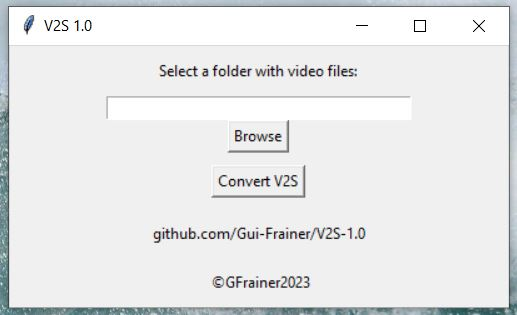

# V2S 1.0:
This app was designed to read any video file in a certain folder, and extract the audio of those videos and save them as .wav files while adding '_audio' to the filename.

Link to download the app for free [here](https://drive.google.com/drive/folders/1zUdgqjaBJABLnnurk2ehZVyGq-Sc4QEZ?usp=sharing).

